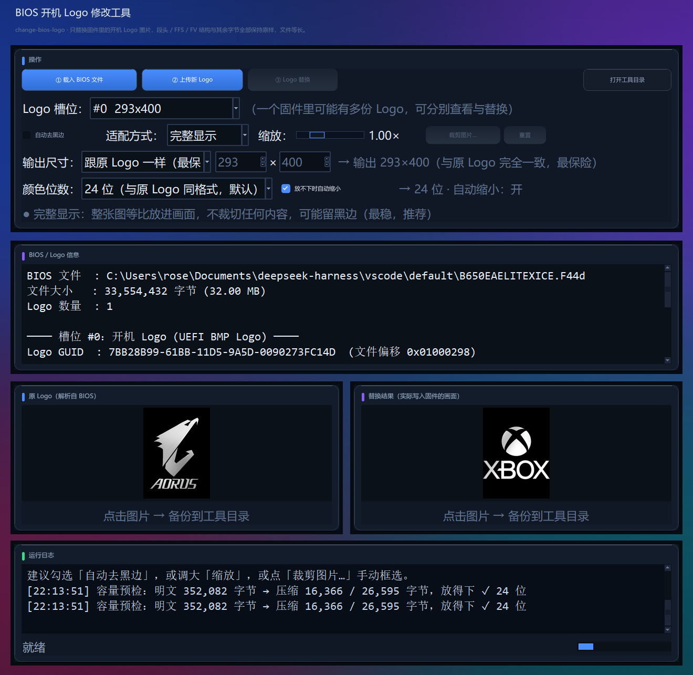
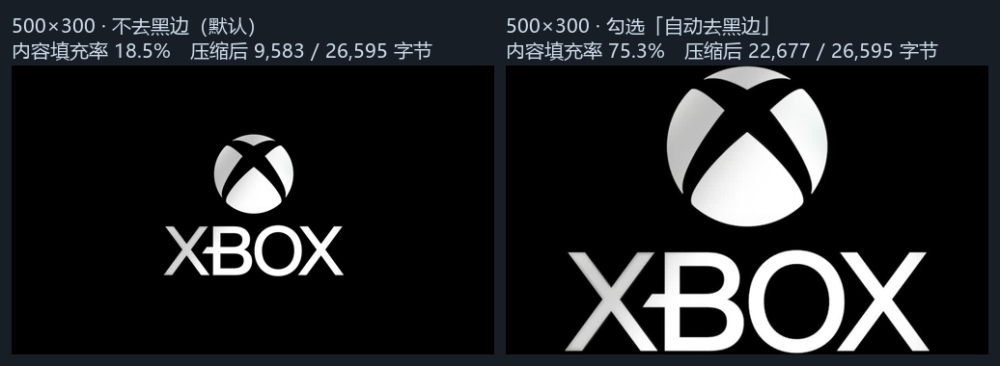
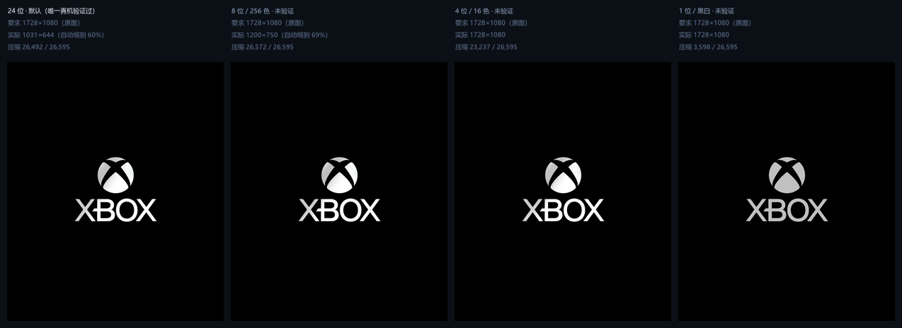

# change-bios-logo

Windows 桌面小工具：**替换 UEFI/BIOS 固件里的开机 Logo 图片**，并重新打包成 BIOS 文件。

只改 Logo 图片，**不动固件代码**：输出文件与输入**严格等长**，FV / FFS / 段头结构与其余字节逐字节保留。



**目录**：[功能](#功能) · [使用](#使用) · [打包](#打包) · [限制](#限制) · [刷写提醒](#刷写提醒) · [原理](#原理简述)

---

## 功能

* **载入 BIOS 文件**（`.F44d` / `.bin` / `.rom` / `.cap` / `.fd`）→ 载入即自动解析，列出固件里所有可替换的 Logo 槽位
* **Logo 解析**：显示 Logo 的 GUID、文件偏移、压缩段参数，并**预览原图**；点击预览图可把原图备份成 PNG
* **上传新 Logo**：只接受图片格式（PNG / JPG / BMP / GIF / WebP / TIFF），**不限文件大小**
* **Logo 替换**：把新图替换进原 Logo，重新打包成新的 BIOS 文件，写出前做五项结构校验
* **图片适配**：自动去黑边、完整显示 / 铺满裁剪 / 拉伸填满、缩放、**手动裁剪对话框**
* **输出尺寸**：跟原 Logo 一样 / 原图尺寸 / 720×480 / 任意自定义（8×8 ~ 8192×8192）
* **颜色位数**：24 / 8 / 4 / 1 位（低位深能放更大的图，但未经真机验证）
* **放不下时自动缩小**：对缩放系数做二分，自动收窄到能塞进压缩段的**最大**尺寸 —— 任意大小的图片都不会失败
* **毛玻璃界面**：深色玻璃主题，磨砂渐变背景 + 半透明圆角卡片，按钮 / 勾选框全部自绘（含 hover / 按下 / 禁用三态）
* 附**命令行接口**，可脚本化 / 批处理

---

界面三个按钮对应完整流程：

| 步骤 | 按钮 | 作用 |
| --- | --- | --- |
| 1 | **① 载入 BIOS 文件** | 弹出文件选择器，选中要修改的 BIOS 固件（`.F44d` / `.bin` / `.rom` / `.cap` / `.fd`）；**载入即自动完成解析**，解析出的 Logo 位置、规格立刻显示在信息面板，原图显示在左侧预览框；**点击预览图即把该图备份成 PNG 到工具目录** |
| 2 | **② 上传新 Logo** | 弹出文件选择器，**只接受图片**（PNG/JPG/BMP/GIF/WebP/TIFF），**不限文件大小**；非图片会被拒绝并提示 |
| 3 | **③ Logo 替换** | 把新图片等长替换进原 Logo，重新打包并写出新的 BIOS 文件，同时做四项安全校验 |

第 2 步之后有三排控件：第一排决定新图怎么填进画面，第二排决定**输出 Logo 的像素尺寸**，第三排决定**颜色位数**与放不下时怎么办。

> 🧭 **第一次用它改 BIOS？请先原封不动地用默认设置（尺寸=「跟原 Logo 一样」、颜色位数=24 位）刷一次。**
> 这一档除了像素内容，结构与固件原样逐字节一致，是唯一"真机验证过一定能显示"的组合。
> 确认开机 Logo 出来了，再回去试「原图 / 自定义尺寸」或调色板位深 —— 那些属于未验证玩法，出问题时你才知道该怀疑哪一项。

**第一排 —— 图片适配：**

| 控件 | 作用 |
| --- | --- |
| **自动去黑边**（默认关） | 自动裁掉图片四周的纯黑边框。图片自带大片黑边时勾上它，Logo 会明显变大 |
| **适配方式** | `完整显示` / `铺满裁剪` / `拉伸填满`，见下表 |
| **缩放** | 0.30× ~ 3.00×，在适配结果上再等比放大/缩小 |
| **裁剪图片…** | 打开裁剪对话框，手动框选要保留的区域（可锁定目标比例） |
| **重置** | 恢复"不去黑边 + 完整显示 + 1.00× + 跟原 Logo 一样" |

**第二排 —— 输出尺寸（默认「跟原 Logo 一样」，可以不跟原 Logo 一样）：**

| 选项 | 含义 |
| --- | --- |
| **跟原 Logo 一样（最保险，默认）** | 沿用原 Logo 的像素尺寸，并**复用原 BMP 头**——解压出来的明文与原来逐字节等长，只换像素。**第一次刷写请先用这一档确认链路没问题** |
| **原图（上传图片的像素尺寸）** | 输出就是**上传图片自己的像素尺寸**，一个像素都不缩放 |
| **720×480** | 固定输出 720×480 |
| **自定义（可填 W×H）** | 手填任意尺寸（8 ~ 8192），输入框默认填 720×480，比例大小随你 |

旁边的 `→ 输出 …` 实时显示**最终会写进固件的尺寸**（非自定义模式下两个输入框只读地显示这个数值）。

**第三排 —— 颜色位数 / 放不下怎么办（决定"一张图最多能放多大"）：**

| 控件 | 作用 |
| --- | --- |
| **颜色位数**（默认 24 位） | `24 位`：与原固件 Logo 格式完全相同，**只有这一档有真机验证**<br>`8 位 / 256 色`、`4 位 / 16 色`、`1 位 / 黑白`：能省一半到十几倍空间、能放更大的图，但**整份固件里没有任何调色板 Logo 的先例，属于未验证选项**——建议先把 24 位刷通、确认开机 Logo 正常，再拿这些档位做实验 |
| **放不下时自动缩小**（默认勾选） | 勾上：尺寸放不下时自动收窄到**能放下的最大尺寸**，并把它作为真正写入的尺寸 —— 于是**任意大小的图片都不会失败**<br>取消：放不下就直接报错，由你自己调小 |

第三排的设置一改，右侧预览会换成**自动缩小后真正写入固件的那张图**，日志里也会写明"已自动缩小到 W×H"。
每次调整后工具会在停手 0.7 秒自动做一次**容量预检**（后台线程，不卡界面），在运行日志里告诉你"压缩后 N / 26,595 字节，放得下 ✓"；放不下会直接说明还差多少以及怎么调。

> **注意**：改尺寸会同时改写两个长度字段 —— 段内 `EFI_GUID_DEFINED_SECTION` 声明的"解压后长度"（`uncompressed size`），以及**解压后明文里那个 `EFI_SECTION_RAW` 头部的 3 字节 section size**。前者管 LZMA 解压，后者管"固件在解压结果里怎么找到那张 BMP"；**两个都必须同步**，否则固件找不到 Logo，开机只会显示主板厂商或 Windows 的默认图案。段头、FV/FFS 之外的一切仍然逐字节不变，文件长度也仍然等长。
> Logo 在开机画面上的**实际大小与位置由固件决定**，改尺寸属于"非标准玩法"；刷入后若显示异常，请切回 **「跟原 Logo 一样」**。

右侧预览框标题为 **替换结果（实际写入固件的画面）**，显示的就是将要写进固件的那张图（尺寸即"输出尺寸"）；点击它备份的也是这张。每次调整都会在运行日志里报告**内容填充率**（内容占画面的面积比），低于 35% 时会提示你调大。

### 适配方式怎么选

| 方式 | 效果 | 代价 |
| --- | --- | --- |
| **完整显示** | 整张图等比放进画面 | 可能留黑边；永远不会裁掉内容 |
| **铺满裁剪** | 放大到铺满整个画面 | 超出画布的部分被裁掉（文字可能被切） |
| **拉伸填满** | 强行拉成目标比例 | 画面会变形 |

> **关于"自动去黑边"（默认不勾）**
> 以 `xbox-logo.png`（1728×1080，内容外接框 672×534）为例，同一张图 500×300 画布：
>
> | | 内容填充率 | 压缩后 |
> | --- | --- | --- |
> | 不勾（默认） | **18.5%** | 9,583 字节 |
> | 勾选 | **75.3%** | 22,677 字节 |
>
> 也就是说：不勾 = 原图长什么样就什么样，Logo 在开机画面上会偏小；勾上 = 主体铺满画面、Logo 明显变大，**代价是压缩后更大，可能超出段内 26,595 字节的容量**。
> 默认不勾选，就是为了"所见即原图"；觉得小就勾上它，同时把「输出尺寸」调小一点（详见下方"限制"里的容量实测表）。



---

## 硬性保证（不碰固件代码）

替换过程**只重写 Logo 所在压缩段内部的字节**：

* 文件总长度与输入文件**完全一致**（等长替换，不会改变任何偏移）；
* 外层的段头（`EFI_COMMON_SECTION_HEADER` / `EFI_GUID_DEFINED_SECTION`）、FFS 头、FV 头**逐字节保留**；
  段内被改写的只有三种字段：**(a)** LZMA 压缩流本身、**(b)** `GUID_DEFINED` 的 8 字节"解压后长度"、**(c)** 解压后明文里 `EFI_SECTION_RAW` 头部的 **3 字节 section size**（= 段头 4 字节 + BMP 字节数）。
  **(c) 是尺寸相关 bug 的根源**：它是"固件在解压结果里找 Logo"的唯一定位依据，换图后不更新就会导致开机不显示新 Logo；
* 写出前自动做五项校验，任一失败就**报错并且不写文件**：
  1. 所有改动字节是否都落在 Logo 段区间内；
  2. 重建后的明文里 section 链是否自洽（逐段走完，且 Logo 段的 size 正好等于"段头 + BMP"）；
  3. 段内声明的"解压后长度"是否与实际明文一致；
  4. 从新文件里回读、解压、和预期像素逐字节比对；
  5. 文件长度是否与输入一致。

替换完成后信息面板会打印改动字节数、改动区间、新压缩流长度与占用比例、新旧 SHA-256。

---

## 支持的 Logo 类型

目前支持标准 UEFI 开机 Logo：

* **GUID**：`7BB28B99-61BB-11D5-9A5D-0090273FC14D`
* 存放形式：`GUID_DEFINED`（`EE4E5898-3914-4259-9D6E-DC7BD79403CF`，LZMA 压缩）段内的 **BMP**，
  或少数固件里直接以未压缩段存放。
* 图片格式：`BITMAPINFOHEADER` 及以上的 **24bpp / 32bpp、BI_RGB（无压缩）** BMP；**也支持写 1 / 4 / 8bpp 调色板 BMP**（工具自己生成头与调色板）。

工具按 UEFI 规范**自动识别**段头、压缩参数（属性字节 → `lc/lp/pb`、字典大小）、压缩流边界与插槽位置，不依赖具体主板型号。若一个固件里存在多份 Logo，槽位下拉框会全部列出，可分别查看与替换。

替换时：新图片先按需**自动去黑边**，再等比缩放（`完整显示` 取 `min(W/原宽, H/原高)`，`铺满裁剪` 取 `max(...)`）并乘上缩放系数，居中贴到**目标尺寸的纯黑画布**上。

目标尺寸由"输出尺寸"决定：`跟原 Logo 一样` 时沿用原尺寸并复用原 BMP 头（与原始 BMP 等长）；选其它模式时按新尺寸**重新生成 BMP 头**，同时刷新段内的"解压后长度"字段。原 AORUS 类开机图是黑底银白图形，因此黑底合成效果自然。

---

## 使用

### 方式一：直接运行 exe

到本仓库的 **Releases** 页面下载 `change-bios-logo.exe`，双击运行即可，**无需安装 Python**。

### 方式二：源码运行

```powershell
pip install -r requirements.txt
python change_bios_logo.py
```

需要 Python 3.10+ 与 Pillow（用到了 `Image.Quantize`、`Image.Dither` 等较新的枚举）。

### 方式三：自己打包成单文件 exe

见 **[BUILD.md](BUILD.md)**，或者直接跑：

```powershell
.\build.ps1
```

### 附带的命令行接口（可脚本化 / 批处理）

```powershell
python bioslogo.py --in B650EAELITEXICE.F44d --list
python bioslogo.py --in B650EAELITEXICE.F44d --extract logo.png
python bioslogo.py --in B650EAELITEXICE.F44d --replace new.png --out out.F44d --fit contain --trim
python bioslogo.py --in B650EAELITEXICE.F44d --replace new.png --out out.F44d --fit cover --zoom 1.2 --trim
python bioslogo.py --in B650EAELITEXICE.F44d --replace new.png --out out.F44d --trim --size-720
python bioslogo.py --in B650EAELITEXICE.F44d --replace new.png --out out.F44d --size-original
python bioslogo.py --in B650EAELITEXICE.F44d --replace new.png --out out.F44d --trim --size-ratio
python bioslogo.py --in B650EAELITEXICE.F44d --replace new.png --out out.F44d --trim --size 500x300
python bioslogo.py --in B650EAELITEXICE.F44d --replace new.png --out out.F44d --size-original --bpp 4 --auto-fit
python bioslogo.py --in X.F44d --replace new.png --slot 1 --out out.F44d
```

`--fit {contain|cover|stretch}` / `--zoom <倍数>` / `--trim` 与界面上的适配控件一一对应；
`--size-720`（固定 720×480）、`--size-original`（原图）、`--size-ratio`（按比例自动算）、
`--size WxH`（自定义）分别对应界面上的四个尺寸选项；**都不带时沿用固件原 Logo 的尺寸**（最保险，与旧版本行为一致）。
`--bpp {24|8|4|1}` 对应"颜色位数"；`--auto-fit` 对应"放不下时自动缩小"。
**`--bpp` 非 24 的三档未经真机验证**（见上文"限制"里的说明），第一次刷写请用默认的 24 位。

同一输入 + 同一图片 + 同一组参数 → 输出 SHA-256 完全一致（结果确定，可复现）。

---

## 备份与输出位置

* **点击预览图备份**：保存到 **工具所在目录** 下的 `backup\` 子目录，
  文件名形如 `原Logo_20261003_163336.png` / `新Logo_20261003_163336.png`。
  （exe 运行时"工具所在目录"就是 exe 所在目录。）
* **新 BIOS 输出**：④ 按钮弹出的保存对话框默认文件名为 `<原文件名>_newlogo<原后缀>`，
  默认目录为输入 BIOS 所在目录。

---

## 限制

* 只做**标准 UEFI BMP 开机 Logo**；若固件把 Logo 放在整卷压缩内部、或使用非 BMP 格式（如 JPEG/自定义封装），工具会明确提示"未找到可替换的开机 Logo"，不会误改文件。
* **输出尺寸可以任意**（8×8 ~ 8192×8192、比例随意），但 Logo 段内的空间是固定的（本例 **26,595 字节**可用）。
  这个数字来自固件本身：Logo 是一个 `GUID_DEFINED`（LZMA）段，段长 `0x6808` 字节，
  减掉 24 字节段头 + 13 字节 LZMA 属性/长度字段 = **26,595 字节的压缩流预算**，改不了（除非改写 FFS 文件头去侵占后面的空闲区，风险高且本机无法验证，本工具不做）。
  勾着"放不下时自动缩小"时，同一张 `xbox-logo.png`（1728×1080）实际能得到的结果：

  **输出尺寸选「原图」（1728×1080），不去黑边：**

  | 颜色位数 | 实际写入 | 压缩后 |
  | --- | --- | --- |
  | 24 位（默认） | 1031×644（自动缩到 60%） | 26,492 |
  | 8 位 / 256 色 | 1200×750（自动缩到 70%） | 26,572 |
  | 4 位 / 16 色 | 1728×1080（原图满尺寸，不用缩） | 23,237 |
  | 1 位 / 黑白 | 1728×1080 | 3,598 |

  **勾上「自动去黑边」（先把黑边裁掉，内容外接框 672×534）：**

  | 颜色位数 | 实际写入 | 压缩后 |
  | --- | --- | --- |
  | 24 位 | 426×338 | 26,588 |
  | 8 位 / 256 色 | 481×382 | 26,587 |
  | 4 位 / 16 色 | 672×534（去黑边后满尺寸） | 20,228 |
  | 1 位 / 黑白 | 672×534 | 2,871 |

  

  > ⚠️ **上表里 8/4/1 位那几行只是"压得进去"的实测，不代表固件一定能显示。**
  > 截至当前，只有 **24 位** 在真机上验证过能正常开机显示；调色板位深（8/4/1）虽然 BMP 头部写得很规范（调色板、`biSizeImage`、行 stride 全部自洽），
  > 但**整份 B650E 固件里找不到任何一个调色板 Logo 的先例**，所以它有可能是固件解码器不支持。
  > 若用调色板位深刷入后开机看不到自制 Logo，先切回 **24 位 + 「跟原 Logo 一样」** 复现一次，再判断是位深问题还是闪存写入问题。

  结论：**位数越低，同样画面压缩后越小，能放的尺寸就越大**。4 位相对 24 位能多放一倍以上；1 位几乎不占空间。
  取消"放不下时自动缩小"后若仍放不下，工具会明确报出"超出多少字节"并给出五条建议，**不会**去动其他区域、也不会写文件。
* **LZMA 属性字节固定沿用固件原值（`0x5D`）**，不做调优。曾经做过"穷举 5 个候选 props 取压缩率最好"的优化，但它只值约 5% 空间，而实测这份固件里几十个 LZMA 段的 `props` **清一色都是 0x5D**，部分 AMI 版本按 0x5D 写死解码器，风险与收益不成比例，已改为始终沿用原值。
* 上传图片**不限大小**（只留 256 MB 的异常保护值）：输出 BIOS 的长度是固定的，与输入图片多大无关；输入图再大也会被等比缩放到能放下的尺寸。
* 仅 Windows（依赖原生文件对话框与 `os.startfile`）。

---

## ⚠️ 刷写提醒

本工具只改开机图，不动固件代码，但**刷写 BIOS 本身始终有风险**：

1. 刷写前**务必备份原始 BIOS**（工具不会修改输入文件，原文件可留作回退）；
2. 使用主板自带刷新工具（技嘉 **Q-Flash / Q-Flash Plus**），在刷写过程中**不要断电**；
3. 若主板支持双 BIOS / BIOS 回退，先确认回退方式可用；
4. 型号必须匹配：**不要把 A 主板的 BIOS 刷到 B 主板上**。

---

## 打包

详细步骤、常见坑与产物校验见 **[BUILD.md](BUILD.md)**。最省事的方式：

```powershell
.\build.ps1
```

脚本会自己建虚拟环境、装依赖、调 PyInstaller 出单文件 `dist\change-bios-logo.exe`，并打印字节数与 SHA-256。

---

## 文件说明

| 文件 | 说明 |
| --- | --- |
| `change_bios_logo.py` | tkinter 图形界面（三个按钮、预览、适配控件、输出尺寸控件、颜色位数控件、裁剪对话框、异步任务） |
| `glass.py` | 毛玻璃视觉工具箱：磨砂背景生成、半透明圆角卡片 `GlassCard`、自绘按钮 `GlassButton`、自绘勾选框 `GlassCheck`、ttk 深色主题、窗口圆角与深色标题栏 |
| `bioslogo.py` | 核心库：固件扫描 / 段解析 / LZMA 解压 / BMP 读写（含 1/4/8bpp 调色板）/ 去黑边 / 适配缩放 / 任意尺寸重打包 / 容量自动缩小 / 等长替换 / 校验；含 CLI |
| `app.ico` | 程序图标（打包时作为 exe 图标） |
| `build.ps1` | 一键打包脚本（生成单文件 exe） |
| `BUILD.md` | 打包说明文档 |
| `requirements.txt` | 运行与打包依赖 |
| `docs\screenshot.png` | 主界面截图 |
| `docs\screenshot_crop.png` | 裁剪对话框截图 |
| `docs\screenshot_trim.png` | 「自动去黑边」开 / 关对照（同尺寸下的填充率与压缩后大小） |
| `docs\screenshot_bpp.png` | 颜色位数对照（24 / 8 / 4 / 1 位各自能放下的最大尺寸） |
| `docs\screenshot_safe_vs_big.png` | 「跟原 Logo 一样」与放大后的尺寸对照 |
| `backup\` | 点击预览图生成的备份图片（运行时创建，已在 `.gitignore` 里） |

---

## 界面主题

界面是**深色毛玻璃**风格，实现在 `glass.py` 里，不依赖任何第三方 UI 库（只用 tkinter + Pillow）。

需要说清楚的一点：**tkinter 没有透明控件，窗口也不支持逐像素 alpha**，所以 DWM 的原生亚克力毛玻璃在 tkinter 里根本露不出来 ——
任何实色子控件都会把它盖住。这里的做法是"自己画玻璃"：

1. 窗口铺一张用 Pillow 现画的磨砂背景（低分辨率画 5 团彩色光斑 → 高斯模糊 → 放大 → 上下压暗 → 叠噪点）；
2. 每张卡片在 `<Configure>` 时**从背景图里裁出自己所在的那一块**，再合成半透明圆角面板（投影 + 外发光 + 竖向渐变 + 1px 描边 + 顶部高光 + 左侧色条标题）；
3. 卡片内部的 `Text` / ttk 控件仍然是实色（tkinter 的硬限制），底色取卡片合成后的实测平均色，误差在 1~2 个色阶内。

按钮与勾选框是自绘的 Canvas 控件（4 倍超采样后缩放，圆角与文字一起享受抗锯齿）。
`GlassButton` 特意重写了 `configure` / `cget` 并拦截 `state` / `text` / `bg`，
所以它能**直接顶替原来的 `ttk.Button`**，业务代码一行都不用改。

### 想改字号 / 配色

全部集中在 `glass.py` 顶部，改一处就够，不用满代码找字面量：

| 常量 | 默认值 | 作用 |
| --- | --- | --- |
| `SIZE_BASE` | `11` | 正文、控件、标签（`apply_theme` 里作为全局默认字体） |
| `SIZE_SMALL` | `10` | 提示 / 说明行 |
| `SIZE_TITLE` | `19` | 窗口大标题 |
| `SIZE_SUB` | `11` | 副标题 |
| `SIZE_CARD` | `12` | 卡片标题 |
| `SIZE_BTN` | `11` | 按钮 |
| `SIZE_CHECK` | `11` | 勾选框 |
| `SIZE_MONO` | `11` | 信息区 / 日志区（等宽） |
| `CARD_TITLE_H` | `26` | 卡片标题占的高度，跟着 `SIZE_CARD` 一起调 |

配色是同一区域的 `BG0` / `PANEL` / `PANEL_IN` / `INSET` / `BORDER` / `INK*` / `ACCENT*` 等常量。

窗口尺寸是**自适应**的（见 `change_bios_logo.py` 里 `_build_ui()` 结尾那段）：按"所有控件都拿到请求尺寸"的高度定窗口，
再夹到屏幕可用范围内，并且会用 Win32 实测一次客户区尺寸来校正 —— 因为个别 DPI 组合下
`geometry()` 里的"像素"与真实客户区并不等价（PyInstaller 冻结版就踩过）。所以放大字号后一般**不需要**手改 `geometry`；
只有在极端缩放下想强制预览区高度时才需要动 `PREVIEW_BOX`。

排查布局问题（预览区被挤扁、控件被裁、窗口比内容小）时，可以带上环境变量看一行诊断输出：

```powershell
$env:CBL_DEBUG_UI = "1"; .\change-bios-logo.exe
# DEBUG screen=3840x2160 scaling=2.0009 req=1192x1277 -> geometry 1320x1285, 实测客户区 (1320, 1285)
```

---

## 原理简述

1. 全文件扫描 Logo GUID `7BB28B99-61BB-11D5-9A5D-0090273FC14D`；
2. 从 GUID 位置反推 4 字节公共头 → 得到 `EFI_GUID_DEFINED` 段起点，读段长与 `DataOffset`；
3. 读 `EFI_GUID_DEFINED_SECTION` 属性字节：`props=0x5D` → `lc=3, lp=0, pb=2`，字典 `dict_size` 随段给出；
4. 用 `lzma.FORMAT_RAW` + 单过滤器 `FILTER_LZMA1` 解压，按段内声明的 `uncompressed size` 截断（原始流不含 EOS，必须带上限解压）；
5. 明文前部找 `BM` → 解析 BMP 头（宽/高/位深/行距/像素偏移）。**注意：明文不是裸 BMP，而是一串 UEFI section**
   —— 实测结构是 `EFI_SECTION_RAW`（4 字节头，**size 字段 3 字节 LE**，载荷就是 BMP）+ 4 字节对齐填充 + `EFI_SECTION_USER_INTERFACE`（内容是 UCS-2 字符串 `"Logo.bmp"`）；
6. 替换时按目标尺寸重写像素数组（沿用原头、或生成新头 / 1·4·8bpp 调色板头），重新 LZMA 压缩并 `0xFF` 补齐到段内原长度，写回 `[stream_off, section_end)`；
   改尺寸 / 位深时**必须同步两个长度字段**：段内的 `uncompressed size`（管 LZMA 解压）与
   **明文里 `EFI_SECTION_RAW` 头部的 3 字节 `size`**（管"固件怎么在解压结果里定位 Logo"）。
   **只改前者、不改后者是一个真实踩过的坑**：BMP 变大/变小后段 size 过期，固件按该 size 走段表就会解析失败，开机只剩 Windows 默认图案。
   重建明文后会用 `check_plaintext()` 重走一遍 section 链做自洽校验。`props` 属性字节则**保持固件原值（0x5D）不动**；
7. **放不下时**（勾了"自动缩小"）对缩放系数做 11 步二分，找出能压进段内的最大尺寸；
8. 调色板位深生成 BMP 时，**必须按亮度重排调色板并重映射索引** —— 否则索引值与明暗无关，平滑渐变会变成跳变的高熵数据，压缩后反而更大（不重排时 4 位几乎没有收益）。

核心库不依赖任何 GUI，可单独导入或由 CLI 调用。
